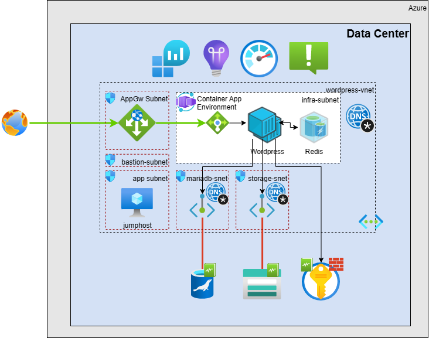
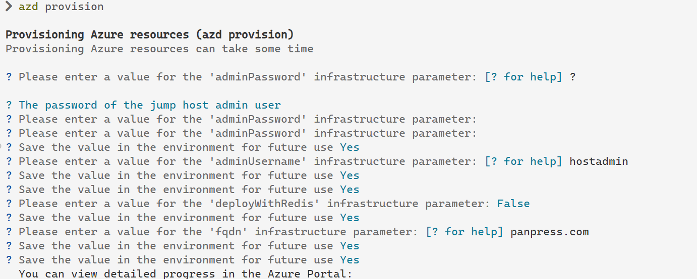
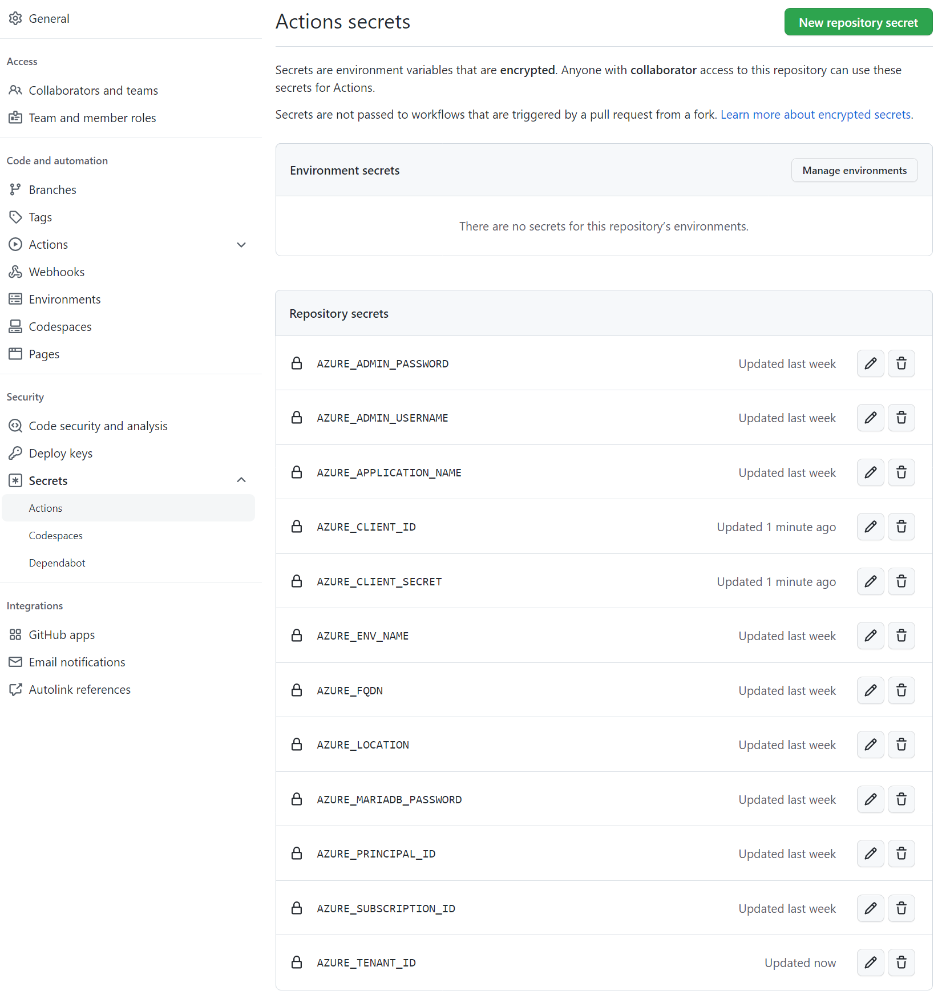
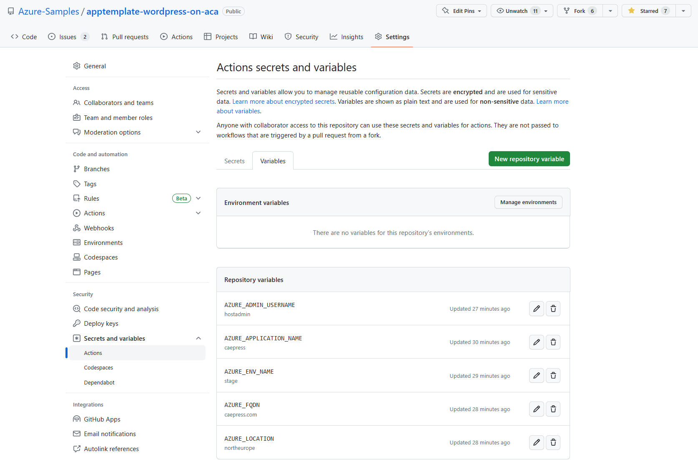
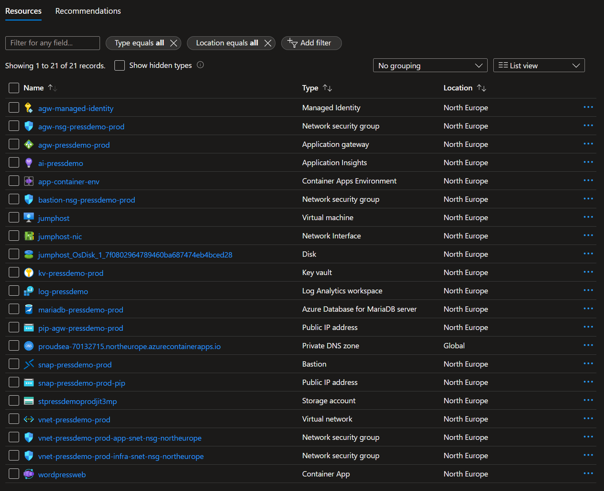
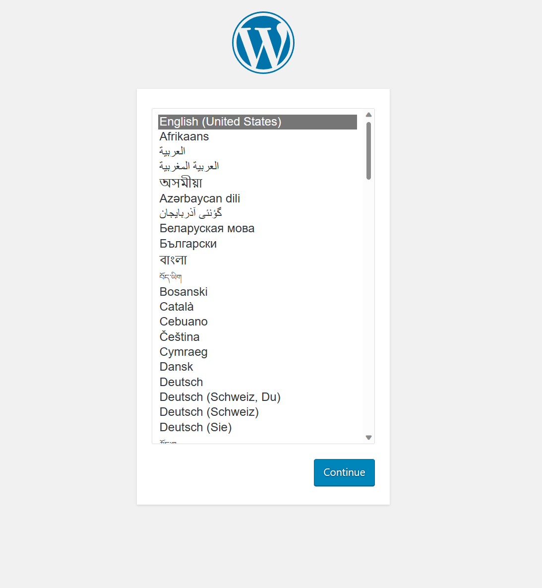
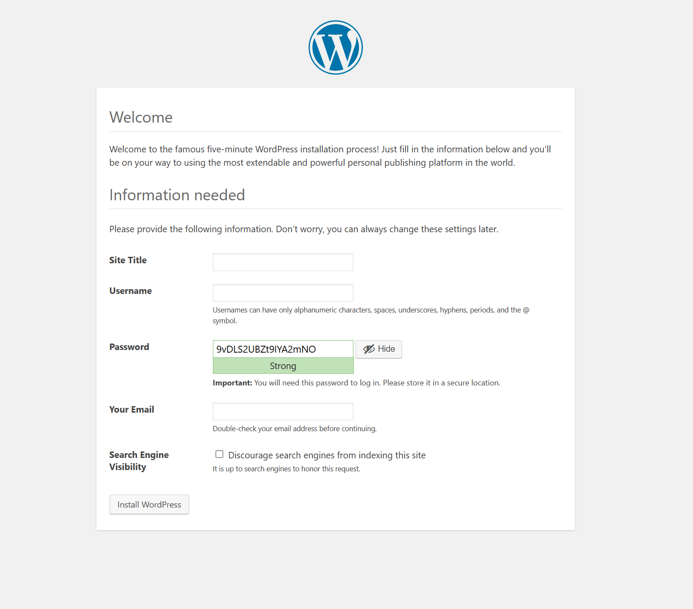

<!-- YAML front-matter schema: https://review.learn.microsoft.com/en-us/help/contribute/samples/process/onboarding?branch=main#supported-metadata-fields-for-readmemd -->

# WordPress appplication template

[](https://github.com/kopantos/app-template-wordpress/actions/workflows/azure-dev.yml)

App Templates are packaged app samples designed to reduce the time it takes a developer to deploy their code to Azure. Unlike standalone example code, the goal of App Templates is to provide all the components to deploy an app to Azure with automation via GitHub Actions or other CI/CD services. 

This specific sample consists of example code, CI/CD components, and documentation containing all the required steps to deploy **a fully functional worspress site** and is designed to be compatible with the [Azure Developer CLI(azd)](https://github.com/Azure/azure-dev/) which is currently in preview.

The purpose of App Templates is to deliver and prove the value of accelerated onboarding for developers who are new to Azure.
> Refer to the [App Templates](https://github.com/microsoft/App-Templates) repo Readme for more samples that are compatible with [Azure Developer CLI (azd)](https://github.com/Azure/azure-dev/)
## Overview 

WordPress (WP or WordPress.org) is a free and open-source content management system (CMS) written in PHP and paired with a MySQL or MariaDB database. Features include a plugin architecture and a template system, referred to within WordPress as "Themes". WordPress was originally created as a blog-publishing system but has evolved to support other web content types including more traditional mailing lists and Internet fora, media galleries, membership sites, learning management systems (LMS) and online stores. One of the most popular content management system solutions in use, WordPress is used by 42.8% of the top 10 million websites as of October 2021.

To function, WordPress at minimum has to be installed on a web server and connect to a mySQL database. So, to deploy Wordpress in Azure a number of different Azure services can be used: [AKS](../mysql/flexible-server/tutorial-deploy-wordpress-on-aks.md), [Virtual Machines](../virtual-machines/linux/tutorial-lamp-stack.md#install-wordpress), and [App Service](https://portal.azure.com/?feature.customportal=false#create/WordPress.WordPress). For a full list of WordPress options on Azure, see [WordPress on Azure Marketplace](https://azuremarketplace.microsoft.com/marketplace/apps?search=wordpress&page=1).

In this application template, you'll learn how to and will be able to easily, quickly create and deploy your first scalable and secure [WordPress](https://www.wordpress.org/) site to Azure, leveraging [Azure Container Apps](https://learn.microsoft.com/en-us/azure/container-apps/overview) with [Azure Database for MariaDb](https://learn.microsoft.com/en-us/azure/mariadb/overview). This app template uses a number of Azure resources, and incurs a cost for your Azure Subscription. For pricing, visit [Azure pricing calculator](https://azure.microsoft.com/en-us/pricing/calculator/). 

## Architecture


## Tech stack:

- Azure
- Azure-database-for-mariadb
- Container Apps / Managed Environments
- Azure Storage
- Azure Key Vault
- Azure Application Gateway
- Azure Networking
- Github Actions
- App Insights
- Log Analytics
- Bicep

## Prerequisites
- Local shell with Azure CLI installed or [Azure Cloud Shell](https://ms.portal.azure.com/#cloudshell/)
- [Azure Developer CLI (azd)](https://github.com/Azure/azure-dev/)
- Azure Subscription, on which you are able to create resources and assign permissions
  - View your subscription using ```az account show``` 
  - If you don't have an account, you can [create one for free](https://azure.microsoft.com/free).  

## Benefits of the solution

Below are benefits and potential extension scenarios for the solution.

1. The solution leverages Bicep as well as Github Actions to provide a single-click deployment of a fully functioning WordPress site following best practices.
1. The solution is built using Azure Container Apps, which is a managed service that allows you to deploy containerized applications to Azure without having to manage the underlying infrastructure. 
1. The solution uses Azure Database for MariaDB, which is also a fully managed database service that allows you to deploy a MariaDB server in Azure without having to manage the underlying infrastructure.
1. The solution deployes Redis Cache to provide a high performance object cache for the application. This allows you to improve the performance of the application.
1. The solution uses Azure Key Vault to store secrets. This allows you to store and manage all the required secrets securely.
1. The solution uses Azure Application Gateway to provide a single entry point to the application. This allows you to manage and control the application traffic and provide a single point of entry to the application.
1. The solution uses Azure Networking to provide a secure network for the application. This allows you to manage the network traffic and provide a secure network for the application.
1. The solution uses Azure Storage to persist state so that all wordpress changes are persistent across running instances.
1. The solution uses Azure Log Analytics and Application insights to monitor the application. This allows you to monitor the application and troubleshoot any issues.

Other potential extensions of this architecture are:

1. Leverage Azure FrontDoor instead of Azure Application Gateway to enable the solution with CDN and allow for global distribution as well as caching content at the edge.
1. Instead of using Docker Hub as the container image repository, deploy an Azure Container registry and manage and control the WordPress and Redis images internally.
1. Leverage multiple Azure Container Apps revisions to deploy the solution in a blue/green deployment model.
1. Leverage Azure DevOps instead of Github Actions to deploy the solution.


## Deployment
You can deploy this app template either using the Azure Developer CLI (azd) or the github pipeline provided.

### Using Azure Developer CLI (azd)

1. Install [Azure Developer CLI](https://aka.ms/azure-dev/install)
1. Login to azure from your terminal. You can do this by running the following command:

    ```
    azd auth login
    ```
1. Create and navigate into an empty directory
1. Clone the repository and initialize the app by running the following command:

    ```
    azd init -t apptemplate-wordpress-on-aca
    ```

    Once the command has finished 
    
    - A directory called .azure is created.
    - Within the .azure directory, a directory is created: <environment_name>.
    - Within the \.azure\<your environment_name> directory, a file named .env is created.
    - The .env file contains information such as the values you supplied:
        - Environment name
        - Location
        - Azure subscription
    
    A file named azure.yaml is created in the root of your project.
    > **Note:** The file is already in the repository.

1. Deploy the ifrastructure by running the following command:

    ```
    azd provision
    ``` 
    This will start the Azure infrastructure provisioning process. Durring this process you will be asked to provide the following information:
    - subscriptionId: The id of the subscription where the resources will be created.
    - location: The location where the resources will be created.
    - mariaDBPassword: The password for the MariaDB server.
    - fqdn: The FQDN of the WordPress site e.g. http://mywordpress.com
    - applicationName: The name of the application. This will be used as a prefix for all the resources created by the deployment.
    - adminUsername: The username for the jumphost VM.
    - adminPassword: The password for the jumphost VM.
    - deployWithRedis: Whether to deploy the solution with a Redis container or not.

        

### Using Github Actions
1. Fork the repository

    Fork the repository by clicking the 'Fork' button on the top right of the page.
    This creates a copy of the repository in your Github account for you to work in. 


2. Create an Azure Service Principal
    
    The newly created GitHub repo uses GitHub Actions to deploy Azure resources and application code automatically. Your subscription is accessed using an Azure Service Principal. This is an identity created for use by applications, hosted services, and automated tools to access Azure resources. The following steps show how to [set up GitHub Actions to deploy Azure applications](https://github.com/Azure/actions-workflow-samples/blob/master/assets/create-secrets-for-GitHub-workflows.md)

    Create an [Azure Service Principal](https://docs.microsoft.com/en-us/cli/azure/create-an-azure-service-principal-azure-cli) with **contributor** permissions on the subscription. The subscription-level permission is needed because the deployment includes creation of the resource group itself.
    
    * login interactively to azure using the following command:
        ```bash
        az login --scope https://graph.microsoft.com//.default
        ```

    * Run the following [az cli](https://docs.microsoft.com/en-us/cli/azure/?view=azure-cli-latest) command, either locally on your command line or on the Cloud Shell. 
    Replace {app-name} {subscription-id} with the id of the subscription in GUID format.
        ```bash  
        az ad sp create-for-rbac --name {app-name} --role owner --scopes /subscriptions/{subscription-id} --sdk-auth     
        ```
    * The command should output a JSON object similar to this:
        ```json
        {
            "clientId": "<GUID>",
            "clientSecret": "<GUID>",
            "subscriptionId": "<GUID>",
            "tenantId": "<GUID>",
            "activeDirectoryEndpointUrl": "<URL>",
            "resourceManagerEndpointUrl": "<URL>",
            "activeDirectoryGraphResourceId": "<URL>",
            "sqlManagementEndpointUrl": "<URL>",
            "galleryEndpointUrl": "<URL>",
            "managementEndpointUrl": "<URL>"
        }
        ```

    store this information as it will be used in the next step.

3. Store the following values as GitHub Actions secrets
    + Under your repository name, click Settings. 
    + In the "Security" section of the sidebar, select Secrets. 
    + At the top of the page, click New repository secret
    + Provide the secret name as AZURE_CREDENTIALS
    + Add the output of the az cli command from the previous step as the value for the secret.
   
4. Repeat the above steps for the following secrets:
    + AZURE_ADMIN_PASSWORD _The password for the jumphost_
    + AZURE_MARIADB_PASSWORD _The password for the MariaDB database_

    You will need to provide the following values as repository secrets to be used by the GitHub Actions workflow.
    

4. Store the following values as GitHub Actions variables
    + Under the repository settings, click on the 'Secrets' tab and add the following variables:
    + AZURE_ADMIN_USERNAME _The username for the jumphost_
    + AZURE_APPLICATION_NAME _The name of the application_
    + AZURE_ENV_NAME _The name of the environment e.g. prod_
    + AZURE_FQDN _The FQDN of the WordPress site e.g. http://mywordpress.com_
    + AZURE_LOCATION _The Azure DC region e.g. westeurope_
    + AZURE_REDIS_DEPLOYMENTOPTIONS _The deployment options for Redis e.g. managed, local, or container_

    You will need to provide the following values as repository secrets to be used by the GitHub Actions workflow.
    

5. Execute the azure-dev.yml action workflow

    + Under your repository name, click Actions .
    + In the left sidebar, click the workflow "Wordpress Deployment".
    + Above the list of workflow runs, select Run workflow .
    + Use the Branch dropdown to select the workflow's main branch, Click Run workflow .

After deployment, below resources will be created




## Getting Started with Wordpress
Since this is a brand new Wordpress site, you will need to complete the initial setup which creates the Database schema and populates it with seed data as well as creates the ```wp-config.php``` file to read the configuration from the environment variables.

To do this, you will first need to **map the FQDN of the site you specified when provisioning the template to the public IP address of the Azure Application Gateway**. You can do this by either adding an entry to your pubcic dns zone or simply by adding an entry to your hosts file.

Once you have mapped the FQDN to the public IP address, you can navigate to the site in your browser and complete the initial setup.
### New WordPress instance
1. Navigate to the http://FQDN using your browser

1. Select the wordpress language and click Continue
    

1. Fill in the site title, the administrator username, password, and email address and click Install WordPress

    

1. Now you can navigate to the site in your browser and login using the username and password you specified during the setup to access the administration console or navigate to the site to see it.

### [Migrate an existing WordPress instance](migrate-wordpress.md)

### [Enanble Redis Cache](redis-cache.md)

### [The Wordpress Docker Image](customize-docker-image.md)

## Clean up resources
When you are done, you can delete all the Azure resources created with this template by running the following command:

```bash
resourceGroup=<RESOURCE GROUP NAME>
az group delete --name $resourceGroup
```

or if you deployed using the azd cli

```
azd down
```

## [Changelog](CHANGELOG.md)

## [Contributing](CONTRIBUTING.md)

## [License](LICENSE.md)
## Trademarks

This project may contain trademarks or logos for projects, products, or services. Authorized use of Microsoft 
trademarks or logos is subject to and must follow 
[Microsoft's Trademark & Brand Guidelines](https://www.microsoft.com/en-us/legal/intellectualproperty/trademarks/usage/general).
Use of Microsoft trademarks or logos in modified versions of this project must not cause confusion or imply Microsoft sponsorship.
Any use of third-party trademarks or logos are subject to those third-party's policies.
