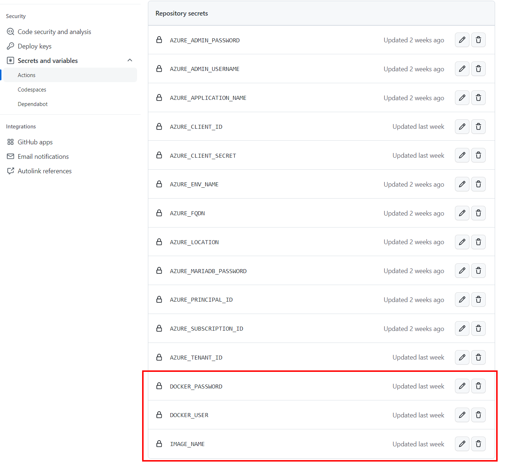

# The Wordpress Docker Image
The provisioning tempate is deploying by default the container image [kpantos/wordpress-alpine-php](https://hub.docker.com/r/kpantos/wordpress-alpine-php) in the Container App environment. This image is a customized version of the official [Azure App Service docker images](https://github.com/Azure/app-service-quickstart-docker-images) which was designed to run on [Azure Web App on Linux](https://docs.microsoft.com/en-us/azure/app-service-web/app-service-linux-intro).

## Components
This docker image currently contains the following components:

1. WordPress
2. Nginx (1.15.8)
3. PHP (7.3.4) 

## Limitations
- Set permalink as "Day and Name" by default. Peformance issue may happen with customized permalink. If like to use customized permalink, need to modify nginx configuration and remove lines of set_permalink() in wp-settings.php.

## Change Log

- **Version 1.2-alpha**
  1. Removed mariadb and PhpAdmin.
  2. Dynamically set the Redis Server configuration values.
  3. Dynamically set the server name.
  
## Docker image customization
The docker image is built from the [Dockerfile](src/Dockerfile) in this repository. You can customize the docker image by modifying the Dockerfile and rebuild the image.

### Build the docker image
To build the docker image, you need to install [Docker](https://docs.docker.com/install/) on your local machine. Once Docker is installed, you can build the docker image by running the following command:

```bash
docker build -t <your-docker-image-name> src/.
```
Then tag the image and push it to your [Docker Hub](https://hub.docker.com/) account.

```bash
docker tag <your-docker-image-name> <your-docker-hub-username>/<your-docker-image-name>
docker push <your-docker-hub-username>/<your-docker-image-name>
```

A Github action named ```Docker``` is also provided to build and publish the docker image to your[Docker Hub](https://hub.docker.com/) account without having to do it locally. Once you have customized the Dockerfile, you can push the changes to the master branch of this repository. The Github action will be triggered to build and publish the docker image to Docker Hub. 

> **Notes:** 
> - You need to create a [Docker Hub](https://hub.docker.com/) account and provide your usernamd and password as Github Secrets to use the Github action.
> - Do not forget to add the Image name you want as a Github Secret.
    
> - To take advantage of the customized image and deploy it to Azure Container Apps, you need to update the [main.parameters.json](main.parameters.json) file and set the value of the variable ```wordpressImage``` to your docker image name.
