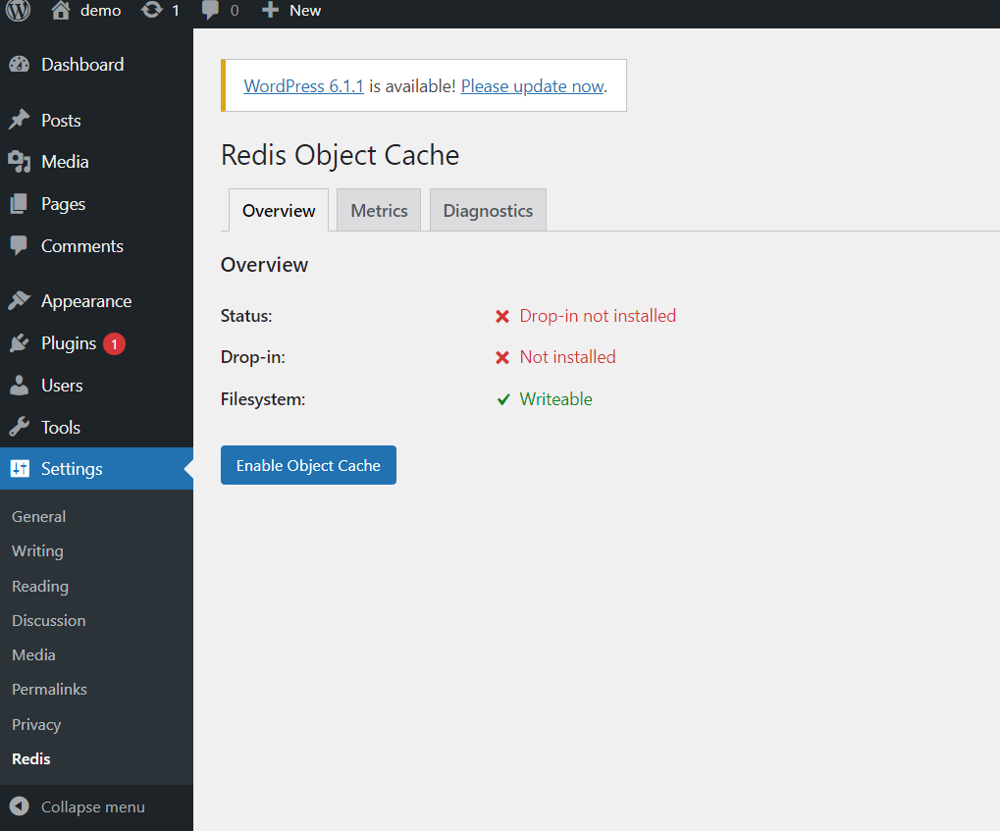
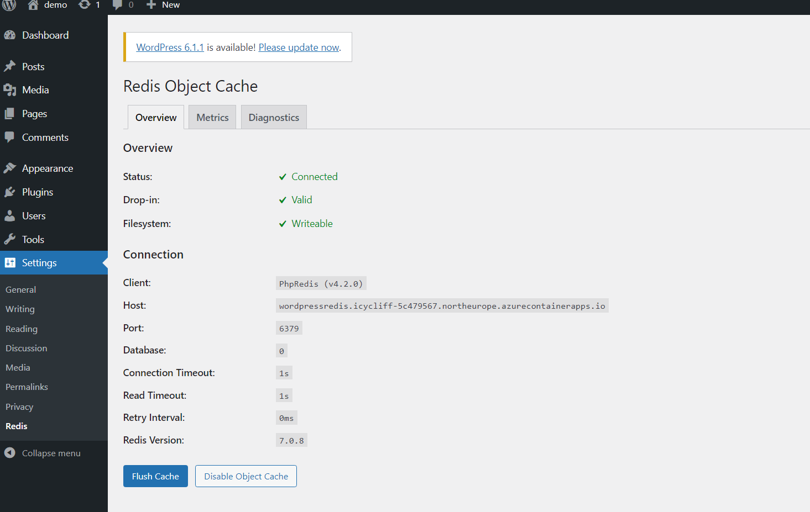

# Enable Redis Object Cache
The provisioning tempate is deploying by default a separate Redis Container App in the same Container App environment where the WordPress Container App is deployed as shown in the architecture diagram.

> **Note:** If you do not want to use a separate Redis Server, you can remove the Redis Container App by setting the variable deployWithRedis to false in the [main.parameters.json](main.parameters.json) file. In that case, the WordPress Container App can leverage the redis service running localy in the same container.

## Enable Redis Object Cache in WordPress
To enable Redis Object Cache in WordPress, you need to install the Redis Object Cache plugin. 

The Redis Object Cache plugin is a drop-in replacement for the WordPress Object Cache, which is used by WordPress to store non-persistent data in memory. This plugin is a fork of the Memcached Object Cache plugin, which is a fork of the APC Object Cache plugin.

You can install the plugin from the WordPress admin dashboard. To do this:

1. Log-in to WordPress admin. In the left navigation, select **Plugins**, and then select **Add New**.
2. Search **Redis Object Cache**, Click **Install**, wait, then click **Activate**.
3. In the left navigation, select **Plugins**, and then select **Installed Plugins**.
4. In the plugins page, find **Redis Object Cache** and click **Settings**.
5. Click the **Enable Object Cache** button.

    

6. WordPress connects to the Redis server. Once the Object Cache is connected, you can verify that the Redis Object Cache plugin is working in the same page or by navigating to the Settings menu and click on the Redis Object Cache link. In the Redis Object Cache Settings page, you should be able to see the status as connected and the Redis server information.
    
    

7. [More infomation about **Redis Object Cache**](https://wordpress.org/plugins/redis-cache)
